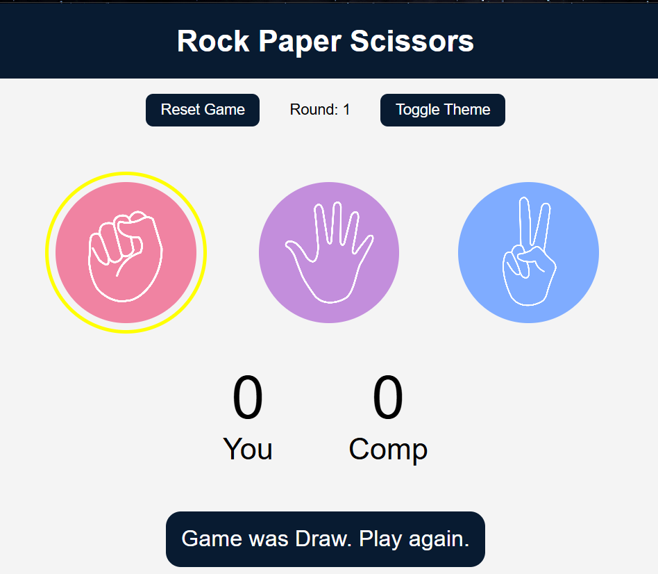
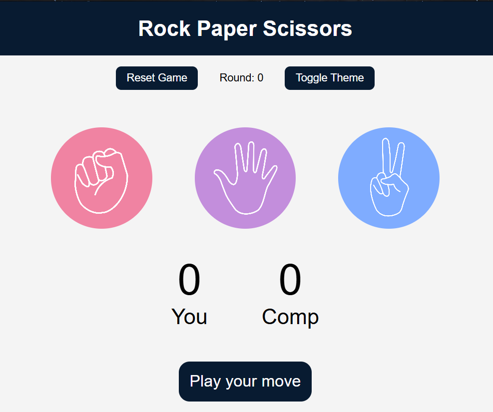
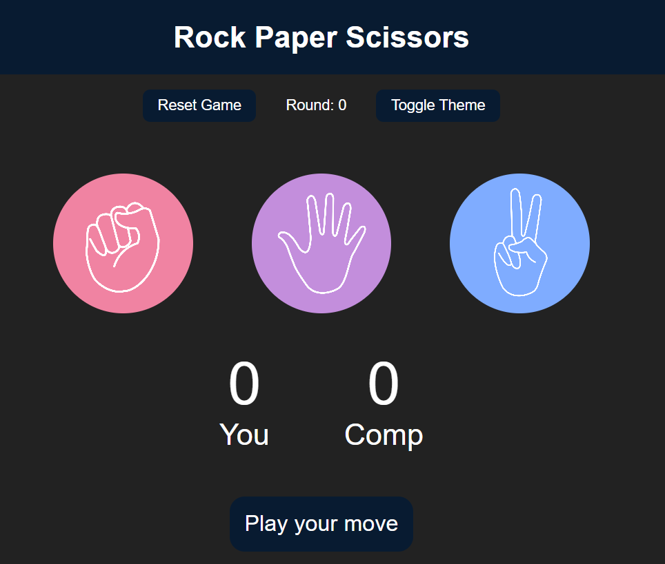
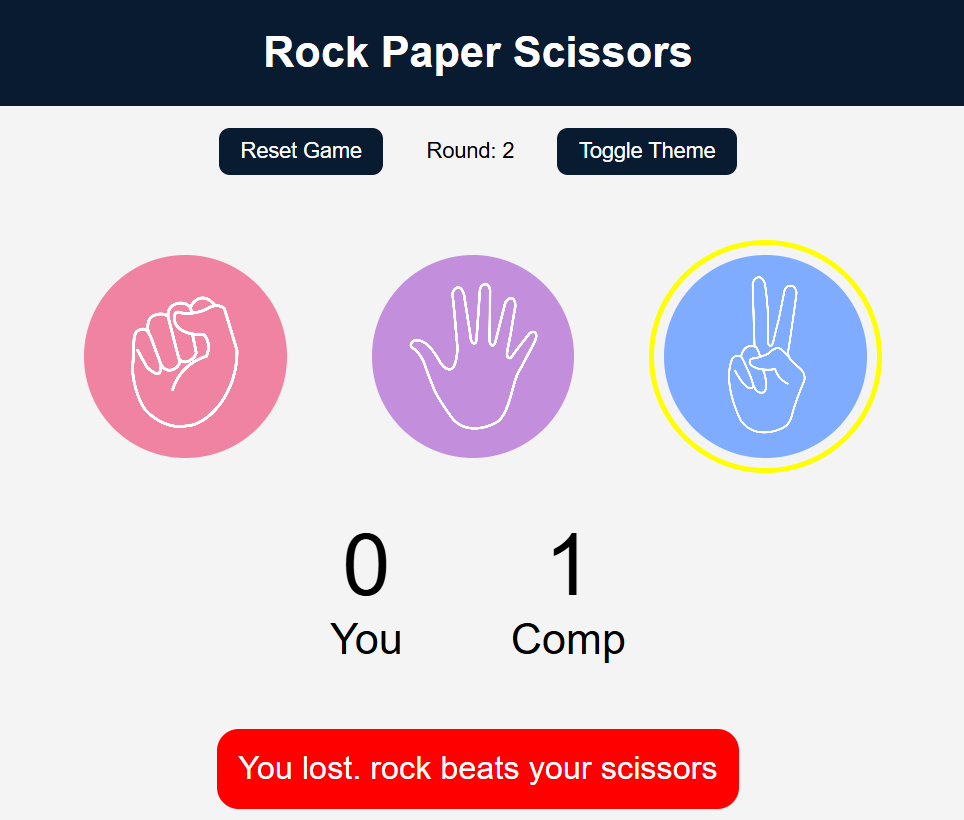

# 🪨 Rock Paper Scissors – Enhanced Version ✂️

This is a fully enhanced version of the classic **Rock Paper Scissors** game built using **HTML**, **CSS**, and **JavaScript**.

---

## 💡 Features

- 🎮 Smooth gameplay with UI feedback
- 🎵 Sound effects for win/lose/draw
- 🌗 Theme toggle (Light & Dark Mode)
- 🔁 Reset Game button
- 📊 Score and Round tracker
- 🎨 Responsive design

---

## 🖼️ Output Screenshots

### 🕹️ Game Interface

### 🟢 Light Theme

### 🌑 Dark Theme

### 🎉 Win Message with Score

### 🎉 Lose Message with Score

---

## 🚀 How to Run

1. Clone or download this repository.
2. Open `index.html` in any modern browser.
3. Play the game and enjoy!

---

## 🛠️ Tech Stack

- HTML5
- CSS3
- JavaScript (Vanilla)

---
